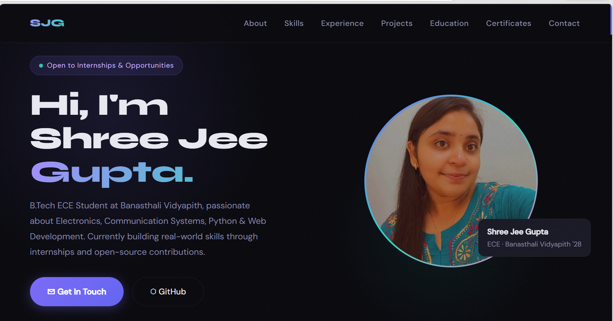

# 🌐 Shree Jee Gupta — Personal Portfolio Website

[](https://shreejee1210.github.io/Portfolio_Website/)
[](https://developer.mozilla.org/en-US/docs/Web/HTML)
[](https://developer.mozilla.org/en-US/docs/Web/CSS)
[](https://developer.mozilla.org/en-US/docs/Web/JavaScript)

---

## 🔗 Live Demo

👉 **https://shreejee1210.github.io/Portfolio_Website/**

---

## 📸 Portfolio Preview

Add your portfolio screenshot here:

```md

```

---

## 📋 Project Description

This project is a modern and responsive **Personal Portfolio Website** developed using **HTML, CSS, and JavaScript**.

The website showcases my academic journey, technical skills, internships, projects, certifications, and achievements in a professional and visually appealing manner. It serves as my digital portfolio and highlights my growth as an Electronics and Communication Engineering student and aspiring developer.

---

## 🎯 Objective

The main objectives of this project are:

* Create a professional online portfolio
* Showcase skills, projects, and achievements
* Improve frontend web development skills
* Learn responsive web design principles
* Build an attractive and user-friendly interface

---

## 🌟 Project Highlights

* Modern Dark-Themed UI
* Fully Responsive Design
* Smooth Scroll Navigation
* Interactive User Experience
* Animated Sections
* Professional Timeline Layout
* Mobile-Friendly Interface
* Clean & Maintainable Code Structure

---

## ✨ Features

| Feature                     | Status |
| --------------------------- | ------ |
| Responsive Design           | ✅      |
| Modern Dark Theme UI        | ✅      |
| Smooth Scrolling Navigation | ✅      |
| Fade-Up Scroll Animations   | ✅      |
| Skills Showcase             | ✅      |
| Experience Timeline         | ✅      |
| Project Gallery             | ✅      |
| Education Section           | ✅      |
| Certifications Section      | ✅      |
| Contact Information Section | ✅      |
| Mobile-Friendly Layout      | ✅      |
| Hover Effects               | ✅      |
| Gradient Visual Effects     | ✅      |

---

## 🛠️ Technologies Used

* HTML5
* CSS3
* JavaScript (ES6)
* Google Fonts

---

## 📁 Project Structure

```text
Portfolio_Website/
│
├── index.html
├── style.css
├── script.js
├── images/
│   └── profile.jpeg
├── images/
│   └── portfolio-preview.png
└── README.md
```

---

## ▶️ How to Run the Project

### Clone the Repository

```bash
git clone https://github.com/shreejee1210/Portfolio_Website.git
```

### Navigate to the Project Folder

```bash
cd Portfolio_Website
```

### Run

Open `index.html` in any modern web browser.

---

## 📊 Repository Information

| Property       | Value                      |
| -------------- | -------------------------- |
| Project Type   | Personal Portfolio Website |
| Internship     | Pinnacle Labs              |
| Status         | Completed ✅                |
| Technologies   | HTML, CSS, JavaScript      |
| Responsiveness | Mobile & Desktop           |

---

## 💡 Skills Highlighted

* 🐍 Python Programming
* ⚡ C Programming
* 🌐 HTML & CSS
* 🐙 Git & GitHub
* 📐 MATLAB
* 📡 Digital Electronics
* 📶 Signals & Systems
* ✏️ AutoCAD

---

## 💼 Experience

| Role                      | Organization  | Duration            |
| ------------------------- | ------------- | ------------------- |
| Web Development Intern    | Pinnacle Labs | June 2026 – Present |
| Python Programming Intern | CodeAlpha     | June 2026 – Present |
| Open Source Contributor   | GSSoC'26      | May 2026 – Present  |

---

## 🎓 Education

| Degree                                           | Institution                   | Duration    |
| ------------------------------------------------ | ----------------------------- | ----------- |
| B.Tech – Electronics & Communication Engineering | Banasthali Vidyapith          | 2024 – 2028 |
| Intermediate (Class XII)                         | Shikhar Shishu Sadan, Dhampur | 2022 – 2024 |
| High School (Class X)                            | Shikhar Shishu Sadan, Dhampur | Until 2022  |

---

## 🏆 Certifications

* Python (Basic) — HackerRank
* MATLAB Onramp — MathWorks
* Dynamic Programming Camp
* All India Scholarship Entrance Test
* GSSoC 2026 Contributor

---

## 🚀 Future Improvements

* [ ] Contact Form Integration
* [ ] Resume Download Feature
* [ ] Project Filtering
* [ ] Light / Dark Theme Toggle
* [ ] Backend Integration

---

## 👩‍💻 Developer

**Shree Jee Gupta**

B.Tech — Electronics & Communication Engineering

Banasthali Vidyapith (2024–2028)

### Connect With Me

💼 LinkedIn:
https://www.linkedin.com/in/shree-jeegupta-b62964329

💻 GitHub:
https://github.com/shreejee1210

📧 Email:
[shreejee7906986152@gmail.com](mailto:shreejee7906986152@gmail.com)

---

## 📝 Internship Information

This project was developed as part of the **Pinnacle Labs Web Development Internship (2026)**.

The portfolio demonstrates practical implementation of:

* HTML5
* CSS3
* JavaScript
* Responsive Design
* Frontend Development Concepts

---

## 🤝 Connect With Me

I am always open to learning opportunities, internships, collaborations, and open-source contributions.

If you found this project useful, don't forget to ⭐ the repository.

Thank you for visiting my portfolio!

---

⭐ **Designed & Developed by Shree Jee Gupta**
